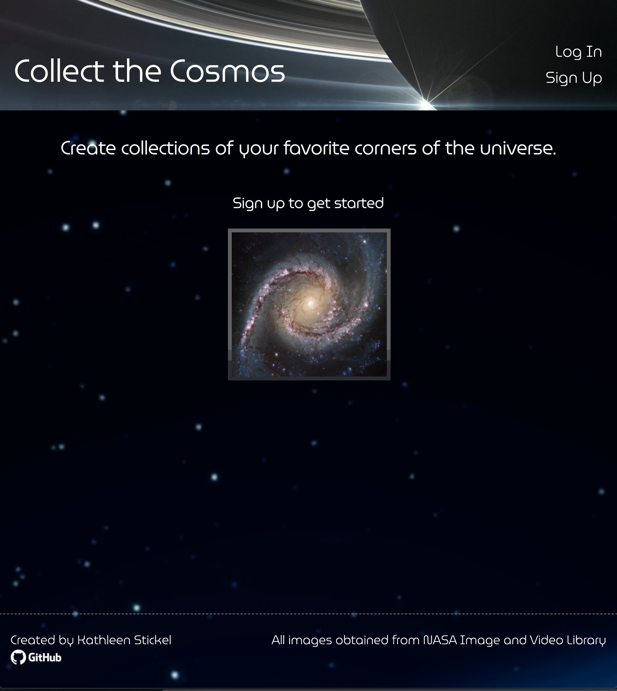
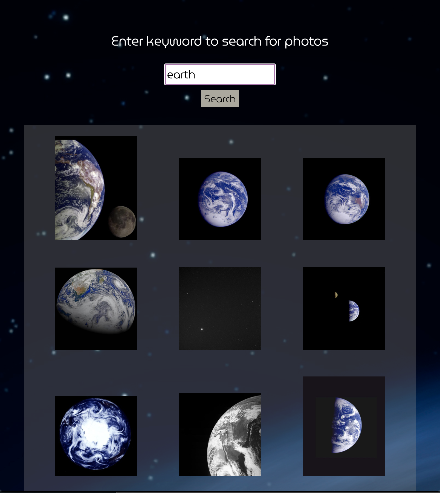
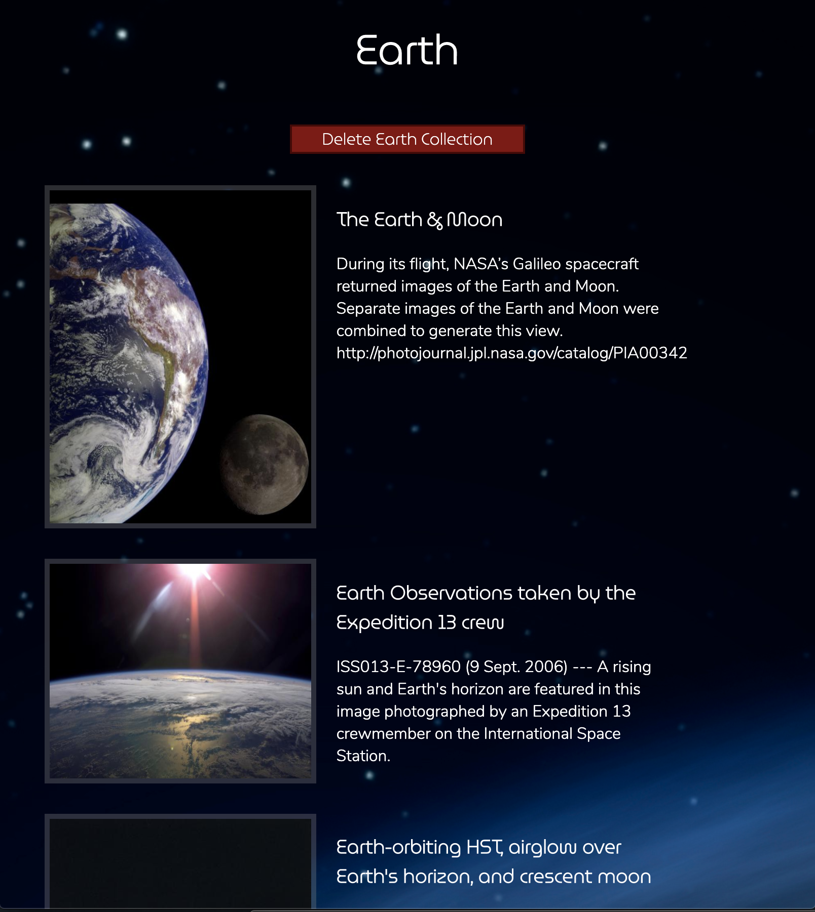

# Collect the Cosmos
Marvel at the universe from the comfort of your home.

Collect the Cosmos is an application that allows users to search for and create collections of photos of stars, planets, and other extraodrinary objects in the unvierse.

# Technologies Used
- MongoDB/Mongoose
- Express
- React
- Node.js
- JavaScript/JSX
- CSS

# Getting Started
[Trello Board](https://trello.com/b/k8mpHRKw/project-4-collect-the-cosmos)

[Click here to launch the app](https://collect-the-cosmos.herokuapp.com/)

# Next Steps
- Add functionality to allow users to search with additional parameters, such as date and location.
- Implement Astronomy Photo of the Day (APOD) API, and allow users to add APOD photos to their collections.
- Add functionality to allow users to delete indivdual photos from their collections.